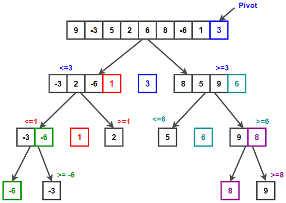

# A look at the Lomuto QuickSort algorithm in JavaScript with median-of-three pivot selection

## Benefits/Drawbacks

The Quicksort algorithm is a strong general-purpose algorithm which is reasonably fast and is an "in-place" operation; it requires very little additional memory to perform.

There are some cases where it could work in *O*(*n^2*) time, although it can usually be expected to be closer to *O*(*n* log *n*); especially using the "median-of-three" technique that I will describe later.

## Overview

In general, these are the basic steps to the Quicksort algorithm:

1. **Pick** an item from the array you are sorting. This element is called the "Pivot".
1. **Compare** elements to the Pivot value.
1. **Swap** elements depending on how they compare to the Pivot value.
    * All items less than the Pivot should end up behind it in the array, and all of those greater than it come after. The array should then have two sides, or "*partitions*", that are separated by the pivot element.
1. **Repeat** the process (recursively) on each of the partitions until the array is sorted.

Take a look at the infographic below to get a sense for how the process flows:


> *This graphic was found within another nice Quicksort article [here](https://www.techiedelight.com/quicksort/)!*


### A note:

Most of our functions for this algorithm should be taking three arguments:
* `arr`: Our complete array of integers to be sorted.
* `start`: The beginning index (inclusive) of the partition to sort.
* `end`: The final index (inclusive) of the partition to sort.
* (our `swap` function will take `arr`, index `i`, and index `j` instead)

This is important! We are passing these `start`/`end` indices each time, because our algorthim will be called recursively on several sections of our array. This allows us to work in-place in memory, instead of needing to create many new and/or temporary arrays in the process of the sort.

## 1. Choosing the Pivot

The easiest way to select a pivot element is to simply grab the first or last element of the array; *however*, this runs at a risk! In cases where an array is already sorted, using this method will result in the slowest possible outcome for this algorithm.

You would be better suited to select an element at random; this will usually result in a lower risk of a very long runtime. This option is a nice balance of easy-to-implement and generally lower risk.

But one of the better ways is to use the "**median-of-three**" method. With a tad bit more work, this strategy approximates a median value for the array -- using this value for the Pivot is more likely to result in a consistent and predictable running time for the sort.

To get our Pivot value with this method, we will start with the first, middle, and last indexes of our array `arr`.

```javascript
const arr = [ 80, 50, 20, 40, 60, 90, 30, 70, 10 ];
```

Now we will find the median of the values found at those indexes: `arr[0]`, `arr[4]`, and `arr[9]` => `80`, `60`, and `10` => `median: 60`.

And that's it! We can use 60 as our pivot value, and it will be reasonably likely that this value will not lead to *O*(*n^2*) time.

Here is how you might implement this in code -- this function will decide which value is the median, and return that value as well as its index in `arr`:
```javascript
 /** Approximates the median of a given array of comparables.
 * Accepts: an array, a start index, and end index.
 * Returns: the median value, its index.
 */
function getMedianOfThree(arr, start, end) {
	let middleIndex = Math.floor((start + end) / 2)
	let medianArray = [
		arr[start],
		arr[middleIndex],
		arr[end]
	]

    // Array.prototype.sort() sorts by ASCII value by default,
    // so we pass our own sort function.
	let target = medianArray.sort((a, b) => {return a - b;})[1]
	// See which value was the median, and return that value and its index.
	switch (target) {
		case arr[start]:
			return [arr[start], start]
		case arr[middleIndex]:
			return [arr[middleIndex], middleIndex]
		case arr[end]:
			return [arr[end], end]
	}
}
```
> *Note: This strategy produces fairly consistent algorithm performance, however it does also take longer than simply picking a random element as Pivot. Tradeoffs!*


## 2. Comparing elements to the Pivot value / Swapping

Now we need use our pivot value as a reference to help arrange the remaining elements.

> [This video](https://www.youtube.com/watch?v=MZaf_9IZCrc) does a great job demonstrating the process visually, and I **highly** recommend watching!

There will be a few steps to do this:

1. Place the pivot element at the end of the array
1. Create two counter variables, `i` and `j`, whose values will begin at `start - 1` and `start` respectively.
1. Compare the value at `arr[j]` to the pivot value.
    * If `arr[j]` is greater than pivot, simply increment `j` by 1, and begin again.
    * Else, if `arr[j]` is less than pivot, then increment `i` by 1 *and **then*** swap the values found at `arr[j]` and `arr[i]`. Finally, increment `j` by 1. If `i === j`, don't worry; the element does not change and the process can move forward.
1. When `j === end`, swap the pivot value (found at `arr[end]`) with the index `i + 1`. Now, all values before the pivot value should be lesser, and all values to the right of the pivot value should be greater. We've created a new partition on either side of the pivot!
1. Then, call the quicksort function again on both partitions (not including the pivot, which is now already in its correct location):
    ```javascript
    quickSort(arr, start, pivotIndex - 1) // the left partition
    quickSort(arr, pivotIndex + 1, end) // the right partition
    ```


## 2.5 Compare / Swap code

To handle moving these values around, we'll need a function that will swap elements between two places in our array:
```javascript
function swap(arr, i, j) {
	let temp = arr[i];
	arr[i] = arr[j];
	arr[j] = temp;
}
```

And next, let's put it to work alongside the logic for the sort! Most resources call this function "partition", and I'll continue with that convention.

```javascript
function partition(arr, start, end) {

    // Approximate the median and move that value to the end of the array
	let [ pivot, pivotIndex ] = getMedianOfThree(arr, start, end)
    swap(arr, pivotIndex, end)

	let i = start - 1;
    // For each element until the pivot, beginning with [0]...
	for (let j = start; j <= end - 1; j++) {

		// If current element is smaller than pivot
		if (arr[j] < pivot) {

			// Increment index of counter i
			i++;
            // and swap the values at i and j
			swap(arr, i, j);
		}
	}

    // Swap the pivot value to the spot after i.
	swap(arr, i + 1, end);
    // Now all elements left of pivot are lesser,
    // and all elements right of pivot are greater!

    // Return the index of pivot, which represents the boundary
    // between the left and right partitions
	return i + 1;
}
```

And now, we may define the `quickSort` function that will run this process until complete:

```javascript
function quickSort(arr, start, end) {

    // Eventually as the sort progresses, start will == end
    // and our sort will be complete.
    if (start < end){
        let partitionIndex = partition(arr, start, end)

        // Sort both partitions;
        // arr[partitionIndex] is already in the correct place.
        quickSort(arr, start, partitionIndex - 1)
        quickSort(arr, partitionIndex + 1, end)
    }
}
```
And there we go! With all of the tools we have created above, we have a working QuickSort. You can give it a try with the array below.

```javascript
const sortMe = [7, 3, 8, 8, 1, 63, 8, 15, 2, 9, 2, 7, 45, 2, 9, 152, 489, 126, 489, 126, 948, 5, 2, 7, 423, 96, 24, 7, 23, 49, 26, 54, 23, 7, 2, 79, 56, 2, 52, 243, 267, 23, 726, 0, 459, 126, 5, 2, 5, 2, 786, 2, 645, 423, 57, 2, 5, 42, 45, 5, 68, 53, 486, 51, 81, 5, 5, 53, 853, 1, 453, 53, 853, 135, 531, 8, 53, 13, 13, 100]

quickSort(sortMe,  0,  sortMe.length - 1)

console.log(sortMe)
```


## References

* Video: https://www.youtube.com/watch?v=MZaf_9IZCrc
* Infographic: https://www.techiedelight.com/quicksort/
* General Information: https://en.wikipedia.org/wiki/Quicksort
* Strategies for improving performance: https://www.cs.cornell.edu/courses/JavaAndDS/files/sort3Quicksort3.pdf
* Another nice high-level overview of quicksort and median-of-three: https://stackoverflow.com/a/33979439
* Comparison between Lomuto and Hoare Quicksort implementations: https://www.interviewkickstart.com/learn/hoares-vs-lomuto-partition-scheme-quicksort